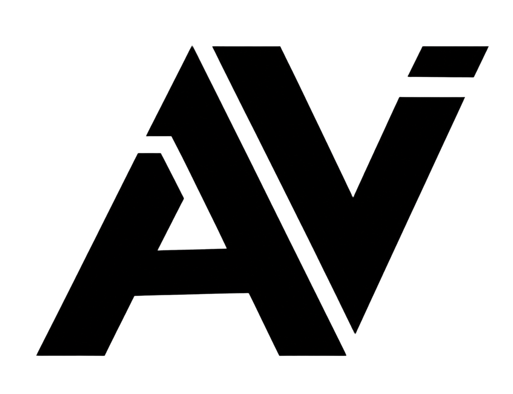

<div align="center">
  

  # 🌐 AudioVision Web UI

  **The Official Landing Page for AudioVision 🗺️🎙️**
  
  [](https://FP-CAPSTONE.github.io/audio-vision-web/)
  [](https://react.dev/)
  [](https://tailwindcss.com/)
  [](https://www.framer.com/motion/)

  <p align="center">
    This repository contains the source code for the official landing page of AudioVision. It was built to showcase the app's powerful features using a premium, visually stunning, Awwwards-style design.
  </p>
</div>

---

## 🚀 Live Demo

Check out the live website here:

👉 **[Visit the AudioVision Website](https://FP-CAPSTONE.github.io/audio-vision-web/)**

---

## ✨ Design Features

This landing page was meticulously crafted to deliver a stunning user experience:

- 🎨 **Premium Aesthetic:** A gorgeous black, white, and glassmorphism theme inspired by modern Apple and Samsung product pages.
- 💨 **Cinematic Animations:** Powered by `framer-motion` for buttery smooth parallax scrolling, fade-ups, and staggered element reveals.
- 📱 **Bento Grid Layout:** Features are elegantly displayed in an asymmetrical, responsive CSS grid.
- 🎥 **Cinematic Video Ad:** A perfectly embedded, silent, auto-playing YouTube trailer with a custom frosted-glass "Click to Unmute" UI.

---

## 📱 About The AudioVision App

AudioVision is an assistive navigation system that converts map and environmental data into **real-time voice guidance**, enabling visually impaired users to move freely and safely without relying on visual cues.

Check out the **[Mobile App Source Code](https://github.com/FP-CAPSTONE/AudioVision)**!

---

## 🛠️ Local Development

To run this website locally on your own machine:

1. **Clone the repository:**
   ```bash
   git clone https://github.com/FP-CAPSTONE/audio-vision-web.git
   cd audio-vision-web
   ```

2. **Install dependencies:**
   ```bash
   npm install
   ```

3. **Start the development server:**
   ```bash
   npm run dev
   ```

4. **Build for production:**
   ```bash
   npm run build
   ```

---

## 🤝 Contributions

Feel free to fork this repository, submit pull requests, or open issues to help improve the landing page! 
